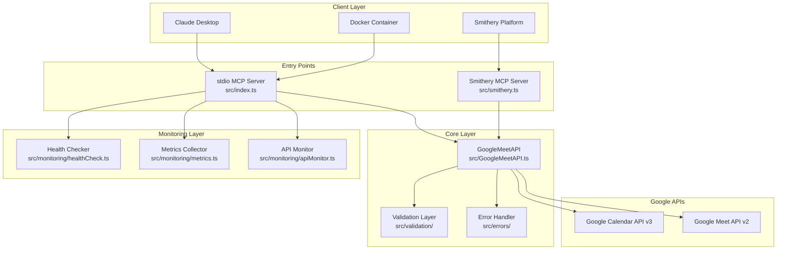
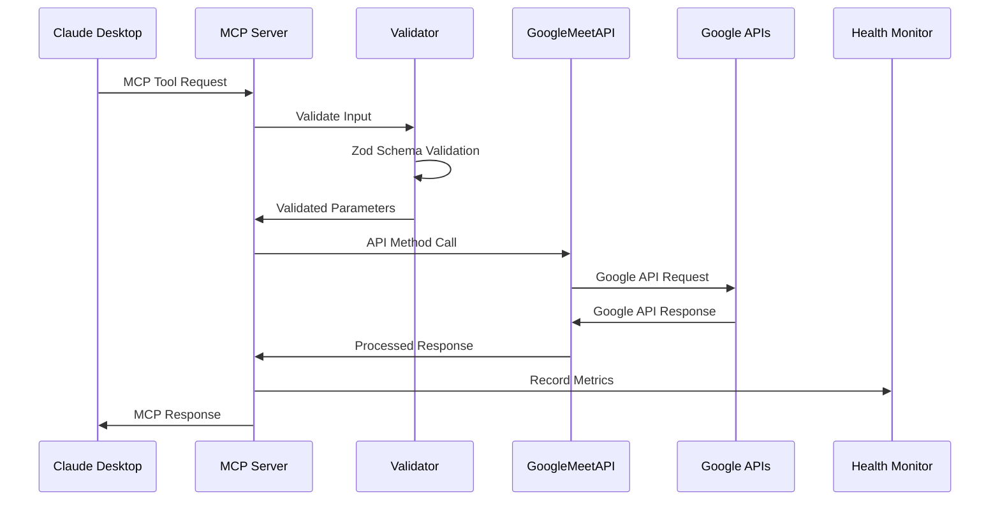
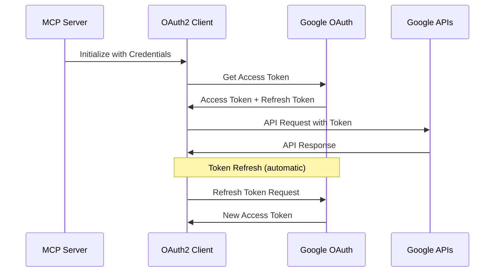

# 🏗️ System Architecture - Google Meet MCP Server v3.0

## 📋 Overview

The Google Meet MCP Server is a Model Context Protocol (MCP) server that provides seamless integration between Claude AI and Google's productivity APIs. It's designed as a multi-entry point system supporting various deployment scenarios with enterprise-grade security and monitoring.

## 🎯 Core Design Principles

### 1. **Multi-Entry Point Architecture**
- **Standard MCP**: Direct MCP server for development and standalone deployment
- **Smithery Compatible**: Stateless server for platform deployment
- **Docker Ready**: Containerized deployment for production environments

### 2. **Authentication Flexibility**
- **Direct Token Auth**: Environment-based tokens (recommended for production)
- **File-based Auth**: JSON credentials for development and legacy systems
- **Multi-method Support**: Automatic detection and fallback mechanisms

### 3. **Comprehensive Validation**
- **Zod Schemas**: Type-safe validation for all 23+ tools
- **Business Logic**: Smart validation with contextual error messages
- **Input Sanitization**: Security-first parameter handling

### 4. **Production-Ready Monitoring**
- **Health Checks**: Multi-level health verification
- **Metrics Collection**: Prometheus-compatible metrics
- **API Monitoring**: Real-time Google API status tracking
- **Performance Tracking**: Response times and resource usage

## 🏛️ High-Level Architecture



## 🧩 Component Architecture

### **Entry Point Layer**

#### 1. **Standard MCP Server (`src/index.ts`)**
- **Purpose**: Primary entry point for direct deployment
- **Transport**: stdio (Model Context Protocol standard)
- **Features**: Full monitoring, health checks, metrics collection
- **Use Cases**: Development, Claude Desktop, Docker deployment

```typescript
class GoogleMeetMcpServer {
  private server: Server;
  private googleMeet: GoogleMeetAPI;
  private healthChecker: HealthChecker;
  private metricsCollector: MetricsCollector;
  private apiMonitor: ApiMonitor;
}
```

#### 2. **Smithery Server (`src/smithery.ts`)**
- **Purpose**: Stateless server for Smithery platform
- **Configuration**: Zod-validated configuration schema
- **Features**: Dynamic API initialization, platform compatibility
- **Use Cases**: Team deployment, managed hosting

```typescript
export const configSchema = z.object({
  CLIENT_ID: z.string().optional(),
  CLIENT_SECRET: z.string().optional(),
  REFRESH_TOKEN: z.string().optional(),
  googleOAuthCredentials: z.string().optional(),
  debug: z.boolean().default(false)
});
```

### **Core API Layer**

#### 1. **GoogleMeetAPI (`src/GoogleMeetAPI.ts`)**
- **Purpose**: Central API integration wrapper
- **Authentication**: OAuth2 with automatic token refresh
- **APIs Integrated**:
  - Google Calendar API v3 (8 tools)
  - Google Meet API v2 (15 tools)
- **Features**: Type-safe methods, error handling, rate limiting

```typescript
class GoogleMeetAPI {
  // Calendar API v3 Methods
  async listCalendars(): Promise<ProcessedCalendar[]>
  async createCalendarEvent(data: CreateEventInput): Promise<ProcessedEvent>
  async listCalendarEvents(): Promise<ProcessedEvent[]>
  
  // Meet API v2 Methods
  async createMeetSpace(config: SpaceConfigInput): Promise<MeetSpace>
  async getMeetSpace(spaceName: string): Promise<MeetSpace>
  async listConferenceRecords(): Promise<ConferenceRecord[]>
}
```

#### 2. **Validation Layer (`src/validation/meetSchemas.ts`)**
- **Purpose**: Comprehensive input validation using Zod
- **Coverage**: All 23 tools with business logic validation
- **Features**: Context-aware error messages, type coercion

```typescript
export const CreateSpaceSchema = z.object({
  access_type: z.enum(['OPEN', 'TRUSTED', 'RESTRICTED']).default('TRUSTED'),
  enable_recording: z.boolean().default(false),
  enable_transcription: z.boolean().default(false)
}).refine((data) => {
  if (data.enable_recording && data.access_type === 'OPEN') {
    throw new Error('Recording cannot be enabled for OPEN access meetings');
  }
  return true;
});
```

#### 3. **Error Handling (`src/errors/GoogleApiErrorHandler.ts`)**
- **Purpose**: Specialized Google API error handling
- **Features**: Context-aware error messages, troubleshooting guidance
- **AI-Optimized**: Error messages designed for AI assistance

```typescript
export class GoogleApiErrorHandler {
  static handleError(error: any, context: string): never
  static handleValidationError(error: ZodError, toolName: string): never
  static logError(error: any, context: string): void
}
```

### **Monitoring Layer**

#### 1. **Health Checker (`src/monitoring/healthCheck.ts`)**
- **Purpose**: Multi-level health verification
- **Checks**: OAuth connectivity, API availability, system resources
- **Endpoints**: `/health`, `/health/detailed`, `/ready`

```typescript
export class HealthChecker {
  async checkOverallHealth(): Promise<HealthStatus>
  async checkGoogleAPIs(): Promise<APIHealthStatus>
  async checkSystemResources(): Promise<SystemHealthStatus>
}
```

#### 2. **Metrics Collector (`src/monitoring/metrics.ts`)**
- **Purpose**: Performance and usage metrics
- **Format**: Prometheus-compatible metrics
- **Metrics**: Tool calls, response times, error rates, API usage

```typescript
export class MetricsCollector {
  recordToolCall(toolName: string, duration: number, success: boolean): void
  recordError(type: string, metadata: ErrorMetadata): void
  getMetrics(): string // Prometheus format
}
```

#### 3. **API Monitor (`src/monitoring/apiMonitor.ts`)**
- **Purpose**: Real-time API status monitoring
- **Coverage**: Google Calendar API v3, Google Meet API v2
- **Features**: Latency tracking, error rate monitoring

## 🔄 Data Flow Architecture

### **Request Processing Flow**



### **Authentication Flow**



## 🛡️ Security Architecture

### **Authentication Security**
- **Individual Credentials**: Each user has separate OAuth credentials
- **Token Management**: Automatic refresh with secure storage
- **Scope Limitation**: Minimal required OAuth scopes
- **Credential Isolation**: No shared secrets between users

### **Transport Security**
- **stdio Transport**: Secure local communication
- **HTTPS Only**: All Google API communication over HTTPS
- **Token Encryption**: OAuth tokens encrypted at rest (when possible)

### **Validation Security**
- **Input Sanitization**: All inputs validated through Zod schemas
- **Business Logic Validation**: Prevents misuse and security issues
- **Rate Limiting**: Built-in protection against abuse

## 📊 Performance Architecture

### **Optimization Strategies**
- **Connection Pooling**: Reused HTTP connections to Google APIs
- **Token Caching**: OAuth tokens cached to reduce auth overhead
- **Response Caching**: Appropriate caching for relatively static data
- **Lazy Loading**: Components loaded only when needed

### **Scalability Considerations**
- **Stateless Design**: Smithery server is fully stateless
- **Horizontal Scaling**: Multiple instances can run independently
- **Resource Limits**: Configurable memory and CPU limits
- **Graceful Degradation**: Continues operating with reduced functionality

## 🔧 Configuration Architecture

### **Multi-Method Configuration**
```typescript
// Method 1: Direct Environment Variables (Recommended)
{
  CLIENT_ID: string;
  CLIENT_SECRET: string;
  REFRESH_TOKEN: string;
}

// Method 2: File-based Configuration
{
  G_OAUTH_CREDENTIALS: string; // Path to credentials.json
}

// Method 3: Legacy Configuration
{
  GOOGLE_MEET_CREDENTIALS_PATH: string;
  GOOGLE_MEET_TOKEN_PATH: string;
}
```

### **Runtime Configuration**
```typescript
{
  NODE_ENV: 'development' | 'production';
  LOG_LEVEL: 'debug' | 'info' | 'warn' | 'error';
  ENABLE_HEALTH_CHECK: boolean;
  HEALTH_CHECK_PORT: number;
}
```

## 📁 File System Architecture

```
google-meet-mcp-server/
├── src/                          # Source code
│   ├── index.ts                  # Main MCP server entry point
│   ├── smithery.ts              # Smithery-compatible entry point
│   ├── GoogleMeetAPI.ts         # Core API wrapper
│   ├── setup.ts                 # OAuth setup utility
│   ├── validation/              # Input validation
│   │   └── meetSchemas.ts       # Zod validation schemas
│   ├── errors/                  # Error handling
│   │   └── GoogleApiErrorHandler.ts
│   ├── monitoring/              # Monitoring and health checks
│   │   ├── healthCheck.ts       # Health verification
│   │   ├── metrics.ts           # Metrics collection
│   │   └── apiMonitor.ts        # API status monitoring
│   ├── endpoints/               # HTTP endpoints
│   │   └── monitoring.ts        # Monitoring endpoints
│   └── types/                   # TypeScript definitions
│       ├── google-apis.d.ts     # Google API types
│       ├── mcp-server.d.ts      # MCP server types
│       └── utilities.d.ts       # Utility types
├── test/                        # Test suite
├── scripts/                     # Build and utility scripts
├── docs/                        # Documentation
└── dist/                        # Compiled JavaScript
```

## 🚀 Deployment Architecture

### **Development Deployment**
- **Local execution** with `npm run start`
- **Hot reload** for rapid development
- **Debug logging** enabled
- **Health checks** on port 9090

### **Production Deployment**
- **Compiled JavaScript** execution
- **Resource optimization** (memory limits)
- **Production logging** (warn level)
- **Health checks** for load balancers

### **Containerized Deployment**
- **Multi-stage Docker builds**
- **Alpine Linux base** for security
- **Non-root user** execution
- **Volume management** for credentials

### **Platform Deployment (Smithery)**
- **Stateless design** for platform compatibility
- **Dynamic configuration** via Zod schemas
- **Automatic health monitoring**
- **Team management** features

## 🔍 Monitoring Architecture

### **Health Check Hierarchy**
1. **Basic Health** (`/health`): Quick status check
2. **Detailed Health** (`/health/detailed`): Comprehensive diagnostics
3. **Readiness Check** (`/ready`): Load balancer compatibility
4. **API Status** (`/api-status`): Google API connectivity

### **Metrics Collection**
- **Tool Usage**: Calls per tool, success rates, response times
- **API Performance**: Google API latency and error rates
- **System Resources**: Memory usage, CPU utilization
- **Error Tracking**: Error types, frequencies, and patterns

### **Alerting Capabilities**
- **Health Check Failures**: Immediate notification
- **High Error Rates**: Threshold-based alerts
- **Performance Degradation**: Response time monitoring
- **Quota Approaching**: Google API quota warnings

---

**🎯 This architecture ensures scalability, security, and maintainability while providing comprehensive Google Meet and Calendar integration for AI-powered workflows.**